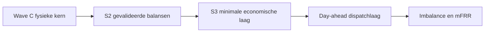

# Wave E memo voor parameterisering van een publiek verdedigbaar staal-MILP

De aangeleverde thesisbrief vraagt expliciet om een evidence-backed memo dat de stap maakt van de technische S2-laag naar een minimale, publiek verdedigbare economische en marktlaag voor een Tata IJmuiden-geïnspireerd staalmodel, zonder ongecontroleerde site-specifieke aannames. De kernconclusie is dat **de eerstvolgende verdedigbare stap niet een “volwaardige marktoptimalisatie” is, maar een smalle S3-laag**: exogene tijdreeksen voor elektriciteit, gas, waterstof en CO₂-prijs; een **bruto ETS-kostenmodule** met **aparte free-allocation-credit**; gereguleerde netwerk-/capaciteitskosten als aparte kostenblokken; en harde scheiding tussen **goedgekeurde inputs**, **kandidaat-/sensitivity-inputs** en **later market design**. Day-ahead biedlogica, imbalance settlement, reserve-inkomsten en volledige CBAM-doorwerking horen pas later thuis. fileciteturn0file0 citeturn6view0turn6view2turn34view2turn35view0turn17view0turn18view3

Mijn expliciete aannames zijn daarom deze. Het model is **publiek reconstrueerbaar**, maar **niet contractueel site-gevalideerd**; er is **geen toegang** tot Tata-specifieke ATO’s, TenneT-contracten, echte benchmarkfiles voor free allocation, interne transferprijzen, of product-mixdata; en het doel is **thesis-verdedigbaarheid**, niet commerciële trading-precisie. Onder die aannames is het methodologisch sterker om de financiële laag klein en transparant te houden dan om schijnprecisie in te bouwen. fileciteturn0file0 citeturn26view0turn27view0turn29view0turn33view3turn37view0turn37view2

## Opdrachtkader en hoofdbevinding

De beleids- en marktomgeving waarbinnen zo’n model moet landen, is complexer geworden, niet eenvoudiger. In de EU ETS blijft veilen het uitgangspunt, maar industrie-installaties ontvangen nog steeds vrije allocatie volgens geharmoniseerde benchmarkregels; benchmarks worden periodiek aangepast en productievolumes beïnvloeden de allocatie. Tegelijk werd CBAM ingevoerd om carbon leakage aan de grens te adresseren, eerst in een overgangsregime en daarna met geleidelijke afbouw van vrije allocatie in CBAM-sectoren. Voor een EU-staalfabriek betekent dat dat **ETS en free allocation een directe modellogica vragen**, terwijl **CBAM vooral een separate handels-/marktmodule is**, niet een simpele adder op de binnenlandse kostprijs. citeturn6view0turn6view2turn6view5turn6view6turn54view0

Ook de fysieke infrastructuur rechtvaardigt terughoudendheid. Gasunie/Hynetwork bouwt een nationaal waterstofnetwerk dat vijf industriële clusters moet verbinden, maar de uitrol is vertraagd: de oorspronkelijke 2030-doelstelling is verschoven en het netwerk zal volgens de actuele planning **uiterlijk 2033** volledig gereed zijn; de eerste delen komen eerder beschikbaar, met Rotterdam als eerste segment en Noordzeekustclusters vóór of rond 2030. Voor een IJmuiden-geïnspireerd model volgt daaruit dat **waterstofbeschikbaarheid geen default-waarheid is**, maar een **scenario- of availability-flag**. Iets vergelijkbaars geldt voor CO₂-transport en -opslag: Aramis zit in ontwikkeling richting investeringsbesluit, maar is dus een infrastructuurvoorwaarde en geen “altijd aan”-input. citeturn34view1turn34view2turn34view3turn35view0

Voor elektriciteitsmarkten is er nog een tweede reden om eerst klein te beginnen. EPEX SPOT voert de day-ahead auction uit met orderboeksluiting om 12:00 CET en publicatie vanaf 12:55; SDAC koppelt biedzones Europees via EUPHEMIA; en sinds oktober 2025 is de 15-minuten market time unit in SDAC operationeel. Een thesis-model op uurresolutie kan dus nog steeds een legitieme onderzoeksvereenvoudiging zijn, maar **een markt-implementabel Netherlands day-ahead model vereist inmiddels expliciete aandacht voor 15-minuten granulariteit**. Dat maakt het verstandig om eerst S2/S3 te stabiliseren en pas daarna day-ahead bieding en helemaal daarna imbalance/mFRR toe te voegen. citeturn17view0turn18view0turn18view1turn18view2turn18view3

## Broninventaris

De onderstaande inventaris scheidt primaire/official bronnen, recente sectoranalyses en enkele noodzakelijke secundaire contextbronnen. De selectie is niet exhaustief; zij is gericht op bronnen die direct bruikbaar zijn voor parameterdefinitie, modelscope en thesis-verdediging.

| Source ID | Titel | Organisatie | Jaar | Stabiele URL of DOI | Type | Kwaliteit | Hoofdgebruik | Beperking |
|---|---|---|---:|---|---|---|---|---|
| F0 fileciteturn0file0 | Aangeleverde thesisbrief Deepsearch-5 / Wave E | gebruiker-upload | 2026 | `n.v.t. conversation file` | interne opdrachtbron | primair voor scope | exacte vraag, Wave A–D context, deliverables | geen externe verificatiebron |
| S1 citeturn6view0turn6view2 | About free allocation | Europese Commissie DG CLIMA | actueel | `https://climate.ec.europa.eu/eu-action/carbon-markets/eu-emissions-trading-system-eu-ets/free-allocation/about-free-allocation_en` | officiële webpagina | hoog | logica vrije allocatie, benchmarks, fallback-methoden | geen site-specifieke benchmarkfile |
| S2 citeturn53view0 | Delegated Regulation (EU) 2024/873 | EUR-Lex / EU | 2024 | `http://data.europa.eu/eli/reg_del/2024/873/oj` | officiële wetgeving | zeer hoog | actuele juridische basis benchmark/free allocation-update | juridisch, niet operationeel samengevat |
| S3 citeturn5view2turn6view3turn6view4turn6view5turn54view0 | CBAM page + Regulation 2023/956 + Implementing Regulation 2023/1773 | Europese Commissie / EUR-Lex | 2023–2026 | `https://taxation-customs.ec.europa.eu/carbon-border-adjustment-mechanism_en` ; `http://data.europa.eu/eli/reg/2023/956/oj` ; `http://data.europa.eu/eli/reg_impl/2023/1773/oj` | officiële webpagina + wetgeving | zeer hoog | CBAM-scope, transitieperiode, relatie met vrije allocatie | geen eenvoudige cashflow-ready formule voor EU-producerende site |
| S4 citeturn26view0turn27view0turn28view1 | Tarieven grootzakelijk + elektriciteitstarieven 2026 | Liander | 2026 | `https://www.liander.nl/grootzakelijk/tarieven` ; `https://www.liander.nl/-/media/files/tarieven/grootzakelijk/tarieven-2026/tarieven-voor-aansluiting-en-transport-elektriciteit-2026_2.pdf` | officiële netbeheerderpagina + tariefblad | hoog voor tariefstructuur | gecontracteerd transportvermogen, aansluittarief, transporttariefstructuur | illustratief voor Nederlandse structuur, niet Tata/TenneT-specifiek |
| S5 citeturn29view0 | Gas-tarieven profielgrootverbruik 2026 | Liander | 2026 | `https://www.liander.nl/-/media/files/tarieven/grootzakelijk/tarieven-2026/tarieven-voor-aansluiting-en-transport-gas-profiel-2026.pdf` | officieel tariefblad | hoog voor structuur | aansluiting/transport gas, capaciteitstarief logica | profielgrootverbruik; grote staalsite kan andere contractvormen hebben |
| S6 citeturn17view0turn18view3 | Trading Products | EPEX SPOT | actueel | `https://www.epexspot.com/en/tradingproducts` | officiële beursdocumentatie | hoog | day-ahead/intraday products, gate closure, market design | geen gratis volledige prijsdataset in open vorm |
| S7 citeturn17view3turn18view0turn18view1turn18view2 | Single Day-Ahead Coupling | ENTSO-E | actueel | `https://www.entsoe.eu/network_codes/cacm/implementation/sdac/` | officiële platform-/regelpagina | hoog | SDAC, EUPHEMIA, 15-min MTU, biedzonekoppeling | geen site-specifieke biedstrategie |
| S8 citeturn33view3turn34view1turn34view2turn34view3 | Hydrogen network Netherlands | Gasunie | 2024–2025 update | `https://www.gasunie.nl/en/projects/hydrogen-network-netherlands` | officiële projectpagina | hoog | waterstofbeschikbaarheid, uitrolfasering, clusterverbindingen | planning kan wijzigen |
| S9 citeturn35view0 | Aramis | Gasunie | 2025 update | `https://www.gasunie.nl/en/projects/aramis` | officiële projectpagina | hoog | CO₂-transport/opslag availability flag | nog geen gegarandeerde site-aansluiting |
| S10 citeturn37view0 | Iron and Steel Technology Roadmap | IEA | 2020 | `https://www.iea.org/reports/iron-and-steel-technology-roadmap` | officiële analyse | hoog | sector-emissies, technologiepaden, energie-intensiteit | mondiaal en niet sitespecifiek |
| S11 citeturn37view2turn39view3 | 15 insights on the global steel transformation | Agora Industry + Wuppertal Institute | 2023 | `https://www.agora-industry.org/publications/15-insights-on-the-global-steel-transformation` | think-tank analyse | hoog | transitieopties, green iron trade, CCS-beperking, scrap/hydrogen rol | geen plant-by-plant kostendataset |
| S12 citeturn40view0turn40view1 | Commodity Markets / IMF Primary Commodity Prices | Wereldbank / IMF | 2026 actueel | `https://www.worldbank.org/en/research/commodity-markets` ; `https://www.imf.org/en/research/commodity-prices` | officiële databronnen | hoog | publieke commodity-prijsreeksen | geen staalproduct-contractprijzen |
| S13 citeturn41view1 | Dutch TTF Natural Gas Futures | ICE Endex | actueel | `https://www.ice.com/products/27996665/Dutch-TTF-Gas-Futures` | officiële productspecificatie | hoog | TTF-prijsdefinitie, contracteenheid, delivery logic | futures-structuur, geen gratis historiek in detail |
| S14 citeturn31news3turn31news0 | TenneT flexible contracts / ACM producer tariffs | Reuters op basis van verklaringen TenneT/ACM | 2024–2025 | `n.v.t. cited news source` | hoogwaardige secundaire bron | middel-hoog | recente congestie-/tariefcontext NL | geen volledige primaire contractdocumentatie |
| S15 citeturn47news2turn48news0turn48news1 | Tata Steel Netherlands public context | Reuters | 2024–2025 | `n.v.t. cited news source` | hoogwaardige secundaire bron | middel-hoog | publieke context IJmuiden, green steel, subsidies, verliesdruk | geen contractuele of operationele detaildata |

De bronmix ondersteunt een duidelijke hiërarchie. **EU-wetgeving en Commissiepagina’s** zijn leidend voor ETS/CBAM. **Gasunie, Liander, EPEX en ENTSO-E** zijn leidend voor infrastructuur en marktdesign. **IEA en Agora** zijn leidend voor sectorspecifieke transitielogica. **Reuters** is alleen gebruikt voor recente, publiek relevante Nederlandse/Tata-context waar de primaire pagina’s moeilijk of niet toegankelijk waren in deze sessie. citeturn6view0turn53view0turn34view2turn35view0turn17view0turn18view3turn37view0turn37view2turn31news3turn48news1

## Parameteruniversum en minimale economische laag

De juiste parameterisatie is hier geen lijst van “alles wat ooit economisch relevant kán zijn”, maar een **beslislaag**: wat mag nu al in het model, wat mag alleen als sensitivity, en wat moet naar een latere market-facing fase. De tabel hieronder is daarom normatief: zij vertaalt publieke evidence naar modelstatus.

| Parametergroep | Aanbevolen status | Publiek verdedigbare representatie | Voorkeursbron | Praktische opmerking | Evidentie |
|---|---|---|---|---|---|
| Elektriciteit importprijs | **S3 goedkeuren** | exogene tijdreeks in `€/MWh` | EPEX/SDAC; evt. price feed via marktdata | geen vaste scalar; tijdreeks per MTU/uur | citeturn17view0turn18view3 |
| Elektriciteit exportprijs | **S3 kandidaat** | exogene tijdreeks of gekoppeld aan biedzoneprijs | EPEX/SDAC | alleen als model echte export toestaat | citeturn17view0turn18view3 |
| Elektriciteit importcapaciteit | **S2/S3 goedkeuren indien fysiek onderbouwd** | `MW`-cap per tijdstap | ATO/site-data preferred; publiek hoogstens proxy | niet afleiden uit gemiddeld verbruik | citeturn27view0turn26view0 |
| Elektriciteit exportcapaciteit | **S2/S3 kandidaat** | `MW`-cap per tijdstap | ATO/site-data preferred | publieke bron meestal onvoldoende | citeturn27view0turn26view0 |
| Gecontracteerd transportvermogen | **S2/S3 goedkeuren als contractrootte beschikbaar** | aparte `kW/MW` input voor afname/invoeding | ATO / netbeheercontract | bepaalt tariefcategorie en gebruiksrechten | citeturn27view0turn28view1 |
| Technische aansluitcapaciteit | **S2 kandidaat, site-specifiek vereist** | technische bovengrens van connection | site engineering / netbeheerder | niet publiek hard te valideren voor Tata | citeturn27view0 |
| Gemiddelde vraagniveaus voor validatie | **S2 goedkeuren als validatietarget** | `average MW` of jaarverbruik-doelwaarde | thesis brief / publieke context | alleen validatie, geen harde cap | fileciteturn0file0 citeturn27view0 |
| Netwerktarief transport | **S3 kandidaat** | vastrecht + volumetarief/capaciteitstarief | netbeheerdertariefbladen | publiek alleen als structuur/proxy | citeturn27view0turn26view0 |
| Capaciteit/peak-tarief | **S3 kandidaat** | `€/kW maand` of analoog | netbeheerdertariefbladen | afhankelijk van deelmarkt en contractvorm | citeturn27view0 |
| Belastingen/heffingen elektriciteit | **Later / sensitivity** | aparte exogene adder | fiscale/juridische bron nodig | te contextspecifiek voor eerste public model | citeturn26view0 |
| Aardgasprijs | **S3 goedkeuren** | exogene tijdreeks of scenario in `€/MWh` | TTF/ICE; Wereldbank/IMF aanvullend | expliciet onderscheiden van transporttarief | citeturn41view1turn40view0turn40view1 |
| Gas importcapaciteit | **S2/S3 kandidaat** | `Nm³/h`, `MWth`, of contractcap | site/contractdata preferred | publieke DSO-data hoogstens illustratief | citeturn29view0 |
| Waterstofprijs | **S3 kandidaat/sensitivity** | exogene scenario’s in `€/kg` of `€/MWh_H2` | project-/marktstudies, contractscenario | nog geen stabiele publieke NL siteprijs | citeturn33view3turn37view2 |
| Waterstof availability flag | **S2/S3 goedkeuren** | binaire of datagedreven beschikbaarheidsflag | Gasunie/Hynetwork planning | cruciaal wegens uitrolvertraging | citeturn34view1turn34view2turn34view3 |
| Waterstof backbone connection | **S3 kandidaat** | datum/flag + max transport | Hynetwork/site-data | geen default “ja” | citeturn34view2turn34view3 |
| CO₂-transport/-opslag availability | **S3 kandidaat** | datum/flag + max captured flow | Aramis/site assumptions | infrastructuurafhankelijk | citeturn35view0 |
| CCS availability flag | **S3 kandidaat/sensitivity** | binaire technologieflag | site/projectcontext | technisch mogelijk ≠ economisch wenselijk | citeturn35view0turn37view2 |
| EUA-/ETS-prijs | **S3 goedkeuren** | exogene tijdreeks in `€/tCO2` | EUA market data; ETS framework | modelleer als bruto koolstofkost | citeturn6view0turn6view2turn53view0 |
| Free allocation credit | **S3 kandidaat, apart module** | `tCO2 allowances` of `€/period` credit | benchmarkregime + site HAL | nooit “verstopt” in emissiefactor | citeturn6view0turn6view2turn53view0 |
| CBAM-effect | **Later / aparte handelsmodule** | prijs-/market-share scenario, geen simpele cash-adder | CBAM regulation | voor EU-site geen eenvoudige directe productiekost | citeturn6view5turn6view6turn54view0 |
| Staaloutputwaarde / revenue proxy | **S3 bewuste ontwerpkeuze nodig** | zie aparte opties A–D hieronder | publieke indices zwakker dan energie/carbon | groot risico op schijnprecisie | fileciteturn0file0 citeturn40view0turn40view1 |
| Imbalance/settlementkosten | **Later** | aparte real-time layer | TSO/balancing rules | niet in eerste economische laag | citeturn17view0turn44academia2 |
| Reserveprijs / mFRR-opbrengst | **Later** | aparte reserve module | TSO/balancing rules + market literature | vereist baseline, eligibility, activation logic | citeturn43academia2turn44academia2 |

### Aanbevolen minimale financiële laag

De **smalste verdedigbare S3-laag** is naar mijn oordeel deze:

```text
Totale systeemkost
= elektriciteitsinkoop
+ aardgasinkoop
+ waterstofinkoop
+ overige exogene grondstofkosten
+ variabele O&M
+ bruto ETS-kost
+ gereguleerde net-/capaciteitskosten
- expliciete free-allocation-credit
- expliciete by-product-credit(s)
+ penalty voor niet-gehaalde productie/serviceniveaus
```

Het analytische voordeel van deze formulering is dat zij de **fysieke en boekhoudkundige laag uit elkaar houdt**. Emissies blijven fysiek gezien emissies; ETS blijft een prijs op emissies; vrije allocatie blijft een **afzonderlijke beleidscredit**; en eventuele by-products of exporten worden alleen zichtbaar als de gebruiker ze expliciet activeert. Dat maakt zowel sensitiviteitsanalyse als thesis-verdediging veel sterker dan een “netto emissiefactor” of een hybride margefunctie waarin kosten en beleidscompensaties al onzichtbaar gemengd zijn. citeturn6view0turn6view2turn6view6turn53view0turn37view0



De merit order van uitbreiden is dus belangrijker dan de volledigheid van de eindambitie. Eerst een publieke, traceerbare S3-laag; daarna een day-ahead laag; pas daarna imbalance en reserve. Dat volgt zowel uit de opdrachtbrief als uit de actuele markt- en infrastructuurcomplexiteit. fileciteturn0file0 citeturn17view0turn18view3turn34view1turn35view0

### Staaloutputwaarde en revenue-proxy

De vraag hoe “staalwaarde” in het model moet landen is methodologisch cruciaal. Juist hier is de kans op schijnprecisie het grootst, omdat publieke energie- en carbonprijzen relatief toegankelijk zijn, maar Tata-specifieke productmix, contractprijzen en kwaliteits-/locatie-opslagen dat niet zijn. Daarom is onderstaande vergelijking belangrijker dan het kiezen van één willekeurige scalar.

| Optie | Beschrijving | Voordelen | Risico’s | Geschikt voor forecast-kwaliteitsvergelijking? | Oordeel |
|---|---|---|---|---|---|
| **A** | Exogene verkoopprijs per ton staal uit publieke index/proxy | laat marge-objectief toe; eenvoudig in MILP | publieke staalprijsseries zijn zwakker, vaak generiek en niet sitespecifiek; risico op verkeerde productmixwaardering | matig | alleen gebruiken als expliciete prijsbron en productdefinitie verdedigbaar zijn |
| **B** | Geen expliciete omzet; minimaliseer kosten onder exogene productie-/vraagtarget | hoogste methodologische robuustheid; scheidt forecastkwaliteit van prijsspeculatie | geen directe marge-uitkomst | **hoog** | **aanbevolen basisoptie** voor thesis-hoofdlijn |
| **C** | Productvector met meerdere staalproducten en revenue mix | economisch realistischer | vereist interne productmix, contracten, kwaliteitsspecificaties | laag totdat data hard zijn | alleen voor latere, site-specifieke uitbreiding |
| **D** | Shadow price / transfer value op output | kan handig zijn voor interne coördinatie of duale interpretatie | conceptueel elegant maar extern moeilijk uitlegbaar | matig | bruikbaar als aanvullende analyse, niet als primaire thesis-input |

Mijn aanbeveling is daarom tweelaags. **Voor de hoofdthesis en elk S2/S3-vergelijkingswerk:** gebruik **optie B**. **Alleen als later expliciet een economische dispatch- of margin-vraag centraal komt te staan:** voeg **optie A** toe als transparante, exogene sensitivity-module, liefst met meerdere scenario’s in plaats van één “ware” staalprijs. Dat voorkomt dat vermeende verbeteringen in forecastkwaliteit of procesflexibiliteit in werkelijkheid gewoon een artefact van dubieuze outputwaardering zijn. fileciteturn0file0 citeturn40view0turn40view1turn47news2turn48news0turn58news0

## Koolstof, ETS en carbon-cost treatment

Voor een Europese staalinstallatie moet de koolstoflogica in vier blokken worden gescheiden: **fysieke emissies**, **bruto ETS-kost**, **free-allocation-credit**, en **eventuele CBAM-markteffecten**. De reden is juridisch én analytisch. De Commissie beschrijft vrije allocatie als benchmark-gebaseerd, met product benchmarks en fallback approaches, plus aanvullende factoren zoals carbon leakage factor, lineaire reductie en cross-sectoral correction factor. Tegelijk benadrukt de CBAM-verordening dat CBAM-certificaten in de definitieve fase worden aangepast aan de mate waarin EU ETS-free allocation nog bestaat voor overeenkomstige EU-productie. citeturn6view0turn6view1turn6view2turn6view6

Daaruit volgt voor het model een strakke opbouw:

| Blok | Aanbevolen modellering | Waarom | Evidentie |
|---|---|---|---|
| Fysieke emissies | houd als procesoutput in `tCO2` | fysica moet onafhankelijk blijven van beleidscredits | citeturn37view0 |
| Bruto ETS-kost | `physical emissions × EUA price` | directe cash exposure op emissies | citeturn6view0turn6view6 |
| Free allocation | aparte creditmodule op basis van benchmarks/HAL/productie | anders verberg je beleidscomponent in techniek | citeturn6view0turn6view1turn53view0 |
| Netto ETS-positie | rapportage-uitkomst, niet primaire input | beter voor transparantie en sensitiviteit | citeturn6view2turn53view0 |
| CBAM | apart, buiten basiscostfunctie tenzij je import/export/price-formation modelleert | CBAM is geen simpele binnenlandse productieheffing | citeturn6view5turn6view6turn54view0 |

Voor de thesis zou ik daarom **één centrale carbon policy design choice** formeel vastleggen:  
**“Base case: bruto ETS-kost zichtbaar in objective; free allocation als aparte credit/sensitivity; CBAM buiten de basisobjective.”**  
Dat is inhoudelijk zuiver, consistent met EU-regels en veel beter uitlegbaar dan een geaggregeerde “netto ETS factor”. citeturn6view0turn6view2turn6view5turn53view0

CBAM verdient nog één specifieke waarschuwing. De overgangsperiode liep officieel van **1 oktober 2023 tot en met 31 december 2025** en was rapportage-gedreven; in die periode hoefden importeurs alleen embedded emissions te rapporteren zonder certificaten te kopen of in te leveren. In 2026 is die overgangsfase dus voorbij, maar voor een in de EU producerende staalsite betekent CBAM nog steeds niet automatisch een directe productiekost op binnenlandse output. Het beïnvloedt vooral importpariteit, concurrentiedruk en mogelijk prijsvorming. In een MILP dat nog geen handelsmodule heeft, hoort CBAM daarom **niet** in de eerste objective. citeturn54view0turn6view3turn6view5turn6view6

## Netwerken, infrastructuur en marktinterfaces

### Elektriciteitsnet, aansluiting en transport

De publiek best onderbouwde Nederlandse structuurbron in deze sessie is Liander. Die is **niet Tata-specifiek**, maar wel heel nuttig voor de logica van netkosten en transportrechten. Het tariefblad maakt expliciet dat het elektriciteitstransporttarief afhangt van de **deelmarkt** en dat die indeling gebeurt op basis van **gecontracteerd transportvermogen**; de ATO bevat afname- en invoedingsvermogens; en extra vermogen kan alleen als er voldoende netcapaciteit beschikbaar is. Dat is precies de scheiding die het model moet respecteren tussen **gemiddeld gebruik**, **gecontracteerde rechten** en **technische aansluiting**. citeturn27view0turn28view1turn26view0

| parameter_id | Beschrijving | Aanbevolen bronklasse | Modelrol | Publieke generieke vorm | Status | Sleutelcaveat | Evidentie |
|---|---|---|---|---|---|---|---|
| `p_import_cap_mw` | maximale afname per tijdstap | ATO/site-data | harde constraint | `MW` | kandidaat tot site-onderbouwd | niet uit gemiddelde MW afleiden | citeturn27view0 |
| `p_export_cap_mw` | maximale invoeding/teruglevering | ATO/site-data | harde constraint | `MW` | kandidaat | publieke data meestal afwezig | citeturn27view0 |
| `p_gtv_import_kw` | gecontracteerd transportvermogen afname | ATO / netbeheercontract | bepaalt tariefcategorie en rechten | `kW` of `MW` | goedkeurbaar als contractmatig bekend | juridisch anders dan technische topcapaciteit | citeturn27view0turn28view1 |
| `p_gtv_export_kw` | gecontracteerd transportvermogen invoeding | ATO / netbeheercontract | idem | `kW` of `MW` | kandidaat | relevante exportrechten kunnen anders zijn | citeturn27view0 |
| `p_connection_tech_cap_mva` | technische aansluitcapaciteit | site engineering / netbeheerder | absolute upper bound | `MVA` | site-specifiek nodig | publiek lastig te verifiëren | citeturn27view0 |
| `p_avg_demand_target_mw` | validatiedoel voor gemiddelde belasting | thesisbrief / publiek context | validatie, geen harde cap | `MW avg` | goedkeuren als validatie-only | niet gebruiken als netwerkparameter | fileciteturn0file0 |
| `c_network_fixed` | vastrecht transport/aansluiting | netbeheerdertariefblad | vaste kost | bijv. maandbedrag | kandidaat | DSO-structuur ≠ Tata exact | citeturn27view0turn26view0 |
| `c_network_kw_contract` | capaciteitstarief op gecontracteerd vermogen | netbeheerdertariefblad | capaciteitskost | `€/kW/maand` | kandidaat | deelmarkt-afhankelijk | citeturn27view0turn28view1 |
| `c_network_kw_peak` | piektarief / max maandvermogen | netbeheerdertariefblad | piekkost | `€/kW max maand` | kandidaat | alleen in relevante deelmarkten | citeturn27view0 |
| `c_network_kwh` | volumetarief energie-afname | netbeheerdertariefblad | variabele netkost | `€/kWh` | kandidaat | vaak klein t.o.v. power price maar niet nul | citeturn27view0 |
| `c_time_dependent_transport` | tijdsafhankelijk/flex-contractvoordeel | TenneT-/ACM-context | sensitivity voor congestiecontracten | procent- of profile-based | later/sensitivity | recent product, niet standaard ATO | citeturn31news3 |
| `c_imbalance_settlement` | onbalanskost | TSO/balancing source | real-time cost | `€/MWh imbalance` | later | aparte market layer nodig | citeturn17view0turn44academia2 |

Twee methodologische punten zijn hier cruciaal. Ten eerste: **gemiddelde vraag mag nooit de rol van gecontracteerd of technisch vermogen overnemen**. Ten tweede: **publieke DSO-tarieven zijn bruikbaar als structuurbron en sensitivity-proxy, maar niet als impliciete Tata/TenneT-contractwaarheid**. Sinds TenneT in 2025 flexibelere off-peak contracten uitrolde, is juist duidelijk geworden dat de contractvorm zelf economisch betekenisvol kan zijn; volgens Reuters meldde TenneT dat zulke gebruikers tot ongeveer 65% op nettarieven kunnen besparen. Dat bevestigt vooral dat contractstructuur niet onschuldig is en dus expliciet moet worden getagd als “site-specific missing” wanneer niet geverifieerd. citeturn31news3turn26view0turn27view0

### Gas, waterstof en CO₂-infrastructuur

Bij gas, waterstof en CO₂ moet het model drie verschillende vragen scheiden: **prijs**, **fysieke capaciteit**, en **infrastructuurbeschikbaarheid**. Voor aardgas is de prijsdefinitie relatief helder: TTF is in Europa de referentiehub en ICE specificeert Dutch TTF futures fysiek geleverd op het TTF-virtuele handelsplatform van Gasunie Transport Services, met prijsnotatie in `€/MWh`. Voor publieke commodity-context zijn Wereldbank en IMF bovendien bruikbaar als vrij toegankelijke prijsbronnen. citeturn41view1turn40view0turn40view1

| parameter_id | Beschrijving | Aanbevolen bronklasse | Modelrol | Publieke generieke vorm | Status | Sleutelcaveat | Evidentie |
|---|---|---|---|---|---|---|---|
| `c_gas_ttf_t` | aardgasprijs | ICE/TTF, evt. IMF/WB | exogene tijdreeks/scenario | `€/MWh` | goedkeuren | prijs ≠ transporttarief | citeturn41view1turn40view0turn40view1 |
| `p_gas_import_cap` | gas importcap | site/contractdata | fysieke constraint | `Nm3/h` of `MWth` | kandidaat | publieke DSO- of GTS-structuur is geen sitespecificatie | citeturn29view0 |
| `c_gas_transport` | gas transport/aansluittarief | netbeheerdertariefblad | vaste/capaciteitskost | maandbedrag / capaciteitscomponent | kandidaat | profielgrootverbruikbron is illustratief | citeturn29view0 |
| `c_h2_t` | waterstofprijs | scenario-/marktstudie | exogene tijdreeks of scenario | `€/kg` of `€/MWh_H2` | kandidaat/sensitivity | nog geen robuuste publieke siteprijs | citeturn33view3turn37view2 |
| `f_h2_available_t` | waterstof availability | Hynetwork planning | binaire of gefaseerde beschikbaarheid | `0/1` of datum | goedkeuren | **moet** scenario-afhankelijk zijn | citeturn34view1turn34view2turn34view3 |
| `f_h2_backbone_connected` | backbone aansluiting | Hynetwork/site-data | route-/netwerktoegang | `0/1` + startdatum | kandidaat | geen default “connected” | citeturn34view2turn34view3 |
| `f_ccs_available` | CCS beschikbaar | project-/sitecontext | technologiekeuze | `0/1` | kandidaat/sensitivity | economisch en vergunningstechnisch afhankelijk | citeturn35view0turn37view2 |
| `p_co2_transport_cap` | CO₂-transportcap | Aramis/site-data | fysieke constraint | `tCO2/h` of `tCO2/y` | kandidaat | nog geen sitecontract | citeturn35view0 |
| `c_co2_transport_storage` | CO₂ fee | project-/contractscenario | economische cost term | `€/tCO2` | kandidaat/sensitivity | publiek niet robuust zonder contract | citeturn35view0 |

De harde beleidsimplicatie is hier duidelijk. Voor een eerste publieke S3-laag mag waterstof best economisch worden gerepresenteerd, maar **alleen onder een expliciete availability-flag**. Dat is niet alleen prudent; het is empirisch nodig. Gasunie zelf communiceert immers dat de landelijke uitrol is vertraagd en dat volledige gereedheid nu uiterlijk 2033 wordt beoogd, met clusterfasering in de tussentijd. Precies daarom moet het model een “connected / not connected / connected from date X”-logica aan kunnen. citeturn34view1turn34view2turn34view3

### Day-ahead settlement en latere mFRR-laag

De day-ahead marktlaag is verdedigbaar **na** S3, maar moet dan wel echt als marktlayer worden opgevat. EPEX meldt voor day-ahead auction trading onder meer: één dagelijkse auction, levering de volgende dag, orderboeksluiting om 12:00 CET en publicatie van resultaten vanaf 12:55 CET. ENTSO-E beschrijft SDAC als het pan-Europese day-ahead koppelingsmechanisme via EUPHEMIA, met efficiënte allocatie van schaarse grenscapaciteit. Sinds oktober 2025 is de 15-minuten MTU in SDAC ingevoerd. citeturn17view0turn18view0turn18view1turn18view2turn18view3

| Layer | Minimale parameters | Waarom nodig | Status | Evidentie |
|---|---|---|---|---|
| Day-ahead NL bidding zone | bidding zone id, MTU, timing | koppelt plant aan juiste marktregels | later, maar relatief vroeg | citeturn18view3turn17view0 |
| Day-ahead prijsreeks | `€/MWh` per MTU | objective/schedule | later | citeturn17view0turn18view3 |
| Gate closure | 12:00 CET | informatie- en forecast cut-off | later | citeturn17view0 |
| Result publication | vanaf 12:55 CET | settlement/schedule certainty | later | citeturn17view0 |
| MTU-granulariteit | 15-min sinds 2025 in SDAC | implementabiliteit vs uursimplificatie | later; in lezing nu al benoemen | citeturn18view1turn17view0 |
| Price-taker of bidder-keuze | simplificatiebesluit | bepaalt complexiteit sterk | later | citeturn18view3 |
| Nomination/schedule variable | fysiek leverbaar profiel | koppelt markt en plantoperatie | later | citeturn17view0turn18view3 |
| Imbalance fallback | afwijkingskost buiten DA award | zonder dit is market layer incompleet | later-later | citeturn17view0turn44academia2 |

Voor mFRR en andere reserveproducten is de drempel nog hoger. Ook zonder in deze memo TenneT’s volledige productregels te reconstrueren, toont de optimalisatie-literatuur al dat reserveparticipatie minstens vraagt om **baseline-logica**, **availability/respons reliability**, **capacity withholding** tussen energy en reserve, **activation directions**, en **penalty/settlementstructures**. Daarom is mFRR hier inhoudelijk een **post-S3** module, niet een uitbreiding van dezelfde parameterlaag. citeturn43academia2turn44academia2

## Rode vlaggen en modelgovernance

| Rode vlag | Waarom problematisch | Correcte remedie | Evidentie |
|---|---|---|---|
| Gemiddeld MW-verbruik als netwerkcap gebruiken | verwart validatie met contract- en netrechten | houd `avg_demand_target` strikt apart van `import_cap`/`gtv` | fileciteturn0file0 citeturn27view0 |
| Publieke DSO-tarieven als Tata-exacte waarde invoeren | contractvorm, spanningsniveau en TSO/DSO-context kunnen verschillen | tag als `proxy_public_nl_structure` | citeturn26view0turn27view0 |
| Free allocation wegstoppen in netto emissiefactor | maakt beleidseffect onzichtbaar en slecht auditeerbaar | bruto ETS + aparte creditmodule | citeturn6view0turn6view2turn53view0 |
| CBAM als directe kostenopslag op EU-output modelleren | conceptueel fout voor binnenlandse productie in basis-MILP | verplaats naar handels-/prijsvormingsmodule | citeturn6view5turn6view6turn54view0 |
| Waterstof standaard “beschikbaar” veronderstellen | infrastructuur is gefaseerd en vertraagd | gebruik `availability flag` en startdatumscenario | citeturn34view1turn34view2turn34view3 |
| CCS standaard “beschikbaar” veronderstellen | infrastructuurprojecten zijn nog ontwikkelend | availability + cost + cap apart specificeren | citeturn35view0 |
| Uurmodel als markt-implementabel presenteren zonder nuance | NL/EU day-ahead draait inmiddels ook op 15-min MTU | benoem uurresolutie expliciet als thesis-simplificatie | citeturn18view1turn17view0 |
| Vaste green-steel premium aannemen | marktacceptatie en willingness-to-pay zijn nog zwak/instabiel | behandel productwaarde als scenario of laat weg in base case | citeturn58news0turn48news0turn48news1 |
| DA, imbalance en reserve in één stap toevoegen | verbergt waar economische waarde echt vandaan komt | bouw sequentieel: S3 → DA → reserve | citeturn17view0turn44academia2 |
| Publieke Tata-context gelijkstellen aan plantdata | green-steel plan en subsidies geven richting, geen harde modelparameters | gebruik Tata-info alleen als strategische anchor | fileciteturn0file0 citeturn47news2turn48news1 |

### Open vragen en beperkingen

Dit memo blijft bewust terughoudend op vier punten waar publiek materiaal onvoldoende hard is. Er is geen verifieerbare Tata-specifieke ATO/TenneT-transportstructuur in de gebruikte bronnen; er is geen robuuste publieke productmix- en revenue-dataset voor IJmuiden; de precieze free-allocation-positie vereist site-specifieke benchmark- en activity-level-informatie; en reserve-/imbalance-markten vragen TSO-productregels die voor een thesis pas zinvol zijn nadat de fysieke en minimale economische laag stabiel is. Dat zijn dus geen gaten in de redenering, maar expliciet gelabelde grenzen van wat nu publiek verdedigbaar is. fileciteturn0file0 citeturn27view0turn53view0turn35view0

## Repo-handoff en synthese over Waves A–E

### Hoe dit in de repo moet landen

| Artefact | Wat erin moet | Minimale velden / structuur | Doel |
|---|---|---|---|
| `source_cards.yaml` | één kaart per bron | `source_id`, `title`, `org`, `year`, `url_or_doi`, `type`, `quality`, `use_case`, `limitations`, `citation_ref` | herleidbaarheid |
| `parameter_universe.csv` | alle parameters uit dit memo | `parameter_id`, `group`, `unit`, `status`, `source_class`, `public_proxy_allowed`, `site_specific_required`, `objective_role`, `constraint_role`, `notes` | centrale parameterkaart |
| `candidate_financial_inputs/` | nog niet-goedgekeurde sensitivities | bijv. `h2_price_scenarios.csv`, `network_proxy_nl.csv`, `free_allocation_candidate.xlsx` | sandbox voor kandidaatinputs |
| `assumptions_register.md` | expliciete aannames en verboden shortcuts | `assumption`, `why needed`, `evidence`, `risk_if_wrong`, `owner` | thesis-governance |
| `validation_checks.md` | checks voor S2/S3 | gemiddelde vermogenscheck, emissie/aansluitcheck, tariff-tag check, flag consistency | voorkomt stille modeldrift |
| `approved_input_table_future.csv` | toekomstige “definitieve” inputlijst | zie tabel hieronder | pas vullen na pre-approval |
| `experiment_warnings.md` | rapportagewaarschuwingen | uur vs 15-min, proxy vs site-data, revenue omitted, CBAM omitted, reserve omitted | eerlijke communicatie in thesis |

Voor de toekomstige approve-table adviseer ik precies deze kolommen:

| Kolom | Functie |
|---|---|
| `parameter_id` | unieke sleutel |
| `description` | korte definitie |
| `value_or_timeseries_ref` | bronverwijzing naar dataset |
| `unit` | eenheid |
| `time_resolution` | jaar/maand/dag/uur/15-min |
| `status` | approved / candidate / later |
| `source_id` | link naar bronkaart |
| `site_specificity` | public generic / site specific / unknown |
| `scenario_tag` | base / low / high / delayed |
| `used_in_model_version` | modeltraceerbaarheid |
| `last_reviewed` | governance |
| `review_owner` | accountability |

Deze repo-structuur dwingt af dat economische verrijking niet ongemerkt verandert in slecht gedocumenteerde parametervervuiling. Dat is precies wat een thesis met meerdere “waves” nodig heeft. fileciteturn0file0

### Eindsynthese over Waves A–E

De bruikbare synthese over de eerdere golven is, scherp geformuleerd, deze:

| Onderdeel | Wat je mag meenemen | Wat je moet verwerpen of downgraden | Eindstatus |
|---|---|---|---|
| Wave A/B publieke interpretaties | strategische context, Tata green-steel narratief, publieke transitierichting | harde kosten, capaciteiten, contractstructuren, impliciete tarieven, pseudo-exacte opbrengstveronderstellingen | **alleen context** |
| Wave C clean trace | fysieke massabalansen, energiestromen, proceskoppelingen, validatielogica | geen | **S2-ruggengraat** |
| Wave D framing | vraag welke financiële laag nodig is, ETS/prijs/markt-scope | overhaaste stap naar reserve/imbalance als basismodel | **gebruik als scopefilter** |
| Wave E nu | publieke, smalle S3-laag op procesmodel | geen full market stack forceren | **direct uitvoeren** |

Concreet betekent dit het volgende.

**Klaar voor directe opname in S2:**  
de fysieke structuur uit Wave C, validatiedoelen op gemiddeld verbruik/productie, expliciete capacity placeholders, en infrastructurele flags voor waterstof/CCS zodra je ze als scenario’s wilt doorrekenen. fileciteturn0file0 citeturn34view1turn35view0

**Klaar voor directe opname in S3:**  
elektriciteitsprijs, aardgasprijs, eventueel waterstofprijs als scenario, bruto ETS-prijs, aparte free-allocation-module, expliciete netwerk-/capaciteitskost-proxy’s, by-product credits indien traceerbaar, en een productie-penalty of exogene outputtarget. citeturn6view0turn6view2turn17view0turn41view1turn40view0turn40view1turn27view0

**Alleen sensitivity/kandidaat:**  
site-onzekere netwerktarieven, technische connection caps zonder ATO, waterstofbackbone-datum, CCS-fees, expliciete staalomzetproxies, en netto ETS-positie als afgeleide van benchmark-credits. citeturn27view0turn34view1turn35view0turn53view0

**Uitstellen naar latere market-facing fase:**  
day-ahead bidding, imbalance settlement, reserve/mFRR-opbrengsten, volledige CBAM-doorwerking, stochastische bieding, en gecombineerde energy–reserve co-optimisatie. citeturn17view0turn18view3turn43academia2turn44academia2

De hoofdboodschap is dus eenvoudig maar belangrijk: **maak de thesis eerst sterker door minder te claimen, niet door meer marktlagen te stapelen**. De publiek best verdedigbare volgende stap is een transparante S3-laag bovenop Wave C, met duidelijke scheiding tussen fysica, energieprijzen, koolstofprijs, allocatiecredit en infrastructuurflags. Alles wat daarboven komt, moet expliciet worden gelabeld als latere marktmodule of sensitivity, anders gaat de thesis sneller vooruit in complexiteit dan in geloofwaardigheid. fileciteturn0file0 citeturn6view0turn6view5turn17view0turn34view2turn35view0turn37view0turn37view2